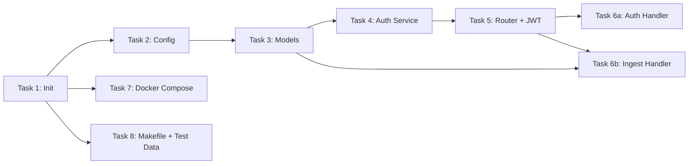

# Phase 1: Project Foundation & Core API — Task Breakdown

## Scope

Phase 1 xây dựng **khung xương** của hệ thống: project structure, config, domain models, Echo router với JWT auth, và các handler cơ bản. Chưa kết nối DB thực — dùng in-memory/stub để test API flow.

---

## Task List

### Task 1: Khởi tạo Go Module & Folder Structure
**Output:** `go.mod`, thư mục theo chuẩn

```
go-data-catalog/
├── cmd/server/main.go
├── internal/api/handlers/
├── internal/api/middleware/
├── internal/model/
├── internal/repository/
├── internal/service/
├── pkg/config/
├── scripts/
├── .env.example
├── Makefile
└── docker-compose.yml
```

### Task 2: Config Loader
**Output:** `pkg/config/config.go`

- Đọc environment variables (hoặc `.env` file)
- Struct `Config` với tất cả fields cần thiết
- Defaults cho dev environment

### Task 3: Domain Models
**Output:** `internal/model/*.go`

| File | Nội dung |
|------|----------|
| `dataset.go` | Dataset, ColumnDef, SchemaVersion |
| `user.go` | User (có password_hash cho auth) |
| `job.go` | Job (Airflow task info) |
| `tag.go` | Tag (key-value) |
| `lineage.go` | LineageEdge, ColumnMapping |
| `event.go` | IngestEvent (API request payload) |
| `response.go` | API response wrappers |

#### Lineage Models (`internal/model/lineage.go`)

```go
package model

import "time"

type LineageEdge struct {
    ID          string    `json:"id" db:"id"`
    SourceType string    `json:"source_type" db:"source_type"` // table, column, job
    SourceID    string    `json:"source_id" db:"source_id"`
    TargetType  string    `json:"target_type" db:"target_type"`
    TargetID    string    `json:"target_id" db:"target_id"`
    Transform   string    `json:"transform" db:"transform"` // e.g., "copy", "sum(col)", "concat(a,b)"
    CreatedAt   time.Time `json:"created_at" db:"created_at"`
    UpdatedAt   time.Time `json:"updated_at" db:"updated_at"`
}

type ColumnMapping struct {
    ID             string    `json:"id" db:"id"`
    SourceDataset  string    `json:"source_dataset" db:"source_dataset"`
    SourceColumn   string    `json:"source_column" db:"source_column"`
    TargetDataset  string    `json:"target_dataset" db:"target_dataset"`
    TargetColumn   string    `json:"target_column" db:"target_column"`
    TransformRule  string    `json:"transform_rule" db:"transform_rule"`
    CreatedAt      time.Time `json:"created_at" db:"created_at"`
}

type LineageGraph struct {
    Nodes []LineageNode `json:"nodes"`
    Edges []LineageEdge `json:"edges"`
}

type LineageNode struct {
    ID   string `json:"id"`
    Type string `json:"type"` // table, column, job, dashboard
    Name string `json:"name"`
}
```

### Task 4: Auth Service (JWT)
**Output:** `internal/service/auth.go`

- `GenerateToken(user)` → JWT token (HS256, 24h expiry)
- `HashPassword(plain)` → bcrypt hash
- `VerifyPassword(hash, plain)` → bool
- Custom claims: `user_id`, `username`, `role`

### Task 5: Echo Router + JWT Middleware
**Output:** `internal/api/router.go`, `internal/api/middleware/jwt_auth.go`

- Public routes: `/auth/login`, `/auth/register`, `/health`
- Protected group: `/api/v1/*` (JWT required)
- Middleware: Logger, Recover, CORS, JWT

### Task 6: Handlers
**Output:** `internal/api/handlers/*.go`

| Handler | Endpoints |
|---------|-----------|
| `auth_handler.go` | `POST /auth/login`, `POST /auth/register` |
| `ingest_handler.go` | `POST /api/v1/ingest` (validate + accept) |
| `dataset_handler.go` | Stubs cho CRUD |
| `health_handler.go` | `GET /health` |

### Task 7: Docker Compose (Dev)
**Output:** `docker-compose.yml`

- PostgreSQL 16
- Memgraph (latest)
- Ports: PG=5432, Memgraph=7687+3000(Lab)

### Task 8: Test Payload & Makefile
**Output:** `scripts/test_payload.json`, `Makefile`

- Sample JSON payload cho `/ingest`
- Makefile targets: `run`, `build`, `test`

---

## Dependency Order



> [!NOTE]
> Phase 1 **không kết nối DB thực**. Auth handler dùng in-memory user store, ingest handler chỉ validate và log payload. Kết nối PostgreSQL/Memgraph sẽ ở Phase 2.
