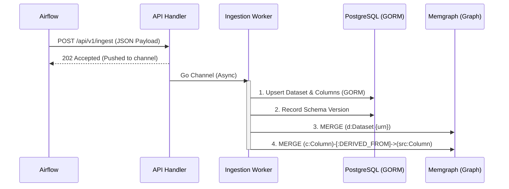

# Phase 2: Database Integration Plan

Mục tiêu: Chuyển đổi hệ thống từ việc lưu trữ trên bộ nhớ tạm (in-memory/stubs) sang lưu trữ vĩnh viễn trên **PostgreSQL** (Metadata) và **Memgraph** (Data Lineage Graph).

## 1. Thành phần công nghệ bổ sung
*   **ORM cho PostgreSQL:** `gorm.io/gorm` và `gorm.io/driver/postgres`.
*   **Driver cho Memgraph:** `github.com/neo4j/neo4j-go-driver/v5` (Memgraph tương thích hoàn toàn với giao thức Bolt của Neo4j).

## 2. Các bước triển khai chi tiết

### Bước 2.1: Quản lý Kết nối Database (Connection Manager)
Tạo package `pkg/database` để khởi tạo và quản lý lifecycle của các kết nối:
*   `pkg/database/postgres.go`: Khởi tạo GORM, kết nối đến PostgreSQL bằng DSN từ file config. Tích hợp tính năng AutoMigrate cho các struct trong `internal/model`.
*   `pkg/database/memgraph.go`: Khởi tạo Neo4j driver, thiết lập session pooling để giao tiếp qua giao thức Bolt.

### Bước 2.2: Implement PostgreSQL Repositories (Relational Metadata)
Tạo các struct thực thi (implement) các interface đã định nghĩa trong `internal/repository/interfaces.go`:
*   `internal/repository/postgres/user_repo.go`: Quản lý tài khoản (Create, FindByUsername).
*   `internal/repository/postgres/dataset_repo.go`: CRUD cho Dataset (Platform, Database, Schema).
*   `internal/repository/postgres/column_repo.go`: Lưu trữ danh sách các cột của từng Dataset.
*   `internal/repository/postgres/schema_repo.go`: Theo dõi lịch sử thay đổi cấu trúc bảng (Schema Versioning).

### Bước 2.3: Implement Memgraph Repository (Graph Lineage)
Tạo implementation cho Lineage trong Graph DB:
*   `internal/repository/memgraph/lineage_repo.go`:
    *   **Nodes:** `:Dataset` và `:Column`.
    *   **Edges:** `:HAS_COLUMN` (Dataset -> Column) và `:DERIVED_FROM` (Target Column -> Source Column).
    *   **Methods:** 
        *   `UpsertDatasetNode`: Tạo node bảng nếu chưa có.
        *   `RecordColumnMapping`: Tạo link biến đổi dữ liệu giữa các cột.
        *   `TraceUpstream` / `TraceDownstream`: Dùng truy vấn Cypher (ví dụ: `MATCH (c:Column {id: $id})-[:DERIVED_FROM*1..5]->(src:Column)`) để lấy đồ thị.

### Bước 2.4: Wiring & Khởi động (main.go)
Sửa đổi `cmd/server/main.go`:
*   Gỡ bỏ các giá trị `nil` (Stub mode) khi khởi tạo Services.
*   Thay vào đó:
    1. Gọi `database.ConnectPostgres()`
    2. Gọi `database.ConnectMemgraph()`
    3. Khởi tạo các repository thực: `repo := postgres.NewDatasetRepository(db)`
    4. Bơm (Inject) các repo này vào `CatalogService` và `LineageService`.

### Bước 2.5: Viết Scripts tạo Constraints cho Memgraph
*   Viết một script chạy lúc startup để đảm bảo Memgraph có các Index và Constraints cần thiết nhằm tối ưu tốc độ truy vấn (vd: Unique constraint trên `Dataset.URN`).

---

## 3. Kiến trúc luồng dữ liệu (Sau Phase 2)

## 4. Hành động cần làm ngay
1. Thêm dependencies (`go get` cho GORM và Neo4j driver).
2. Xây dựng module kết nối `pkg/database`.
3. Implement `postgres/user_repo.go` đầu tiên để Auth API có thể hoạt động hoàn toàn với DB thật.
